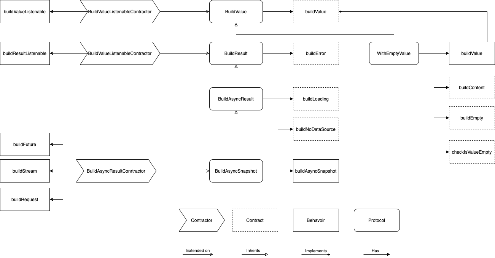

# Concepts behind the design

The library is built with a set of basic concepts, and rules, so it can be as flexible as possible without running into unexpected situations.

* **Protocol** - A certain practice to accomplish a certain task
  * `Protocol` is encapsulated as a `minxin` on code level.
  * `Protocol` contains a bunch of `Behavior` and `Contract`
  * `Protocol` can based another `Protocol`, such as  `BuildResult` is based on `BuildValue`.
* **Behavior** - A method of `protocol` which should not be overrode.
  * `Behavior` is considered as `private` to `protocol`.
  * `Behaviour` shouldn't be changed, or `Protocol` might not work properly.
* **Contract** - A method of `protocol` which must be or can be overrode.
  * `Contract` is used as connection point of host class to `Protocol`. Such as `BuildAsyncSnapshot` requires host class to implement `buildValue` contract.
  * One `Protocol` can implement another `Protocol`'s `Contract`, so they can works together, e.g. `WithEmptyValue` implements `buildValue` contract of `BuildAsyncSnapshot`.
* **Actions** - `Actions` is a bunch of `Behavior` can be done on the types that comply to a certain `Protocol`
   * `Actions` lives as `Extension` in code
   * `Actions` holds a bunch of `Behaviour`
   * `Actions` won't hold `Contract`

